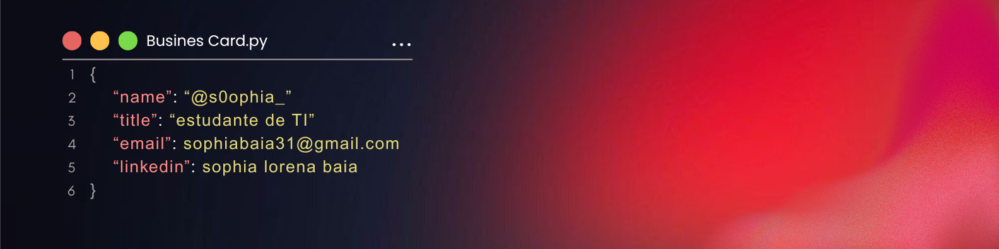

<h1 align="center">Hello World</h1>

###

<h4 align="center">Olá Devs, aqui é a Sophia⭐</h4>

###

  
  
  
  
  
  
  
  
  
  
  
  
  
  
  
  
  
  
  
  
  
  
  

###

  
  
  
  

###

<picture>
  <source media="(prefers-color-scheme: dark)" srcset="https://raw.githubusercontent.com/Sophia044/Sophia044/output/pacman-contribution-graph-dark.svg">
  <source media="(prefers-color-scheme: light)" srcset="https://raw.githubusercontent.com/Sophia044/Sophia044/output/pacman-contribution-graph.svg">
  
</picture>

###

  
  

###
<table>
  <tr>
    <td>
      

   </td>
   <td>
     
## Para programadores e curiosos
 👋 Oi! Eu sou a **Sophia**, tenho 17 anos e atualmente estudo **Análise e Desenvolvimento de Sistemas**.  
💻 Estou me aprofundando em programação, explorando tanto **front-end** quanto **back-end**, e adoro aprender coisas novas todos os dias.  
🎨 Além da tecnologia, tenho uma paixão enorme por **arte, design e música**, que sempre me inspiram a criar.  
🚀 Estou em busca de **oportunidades para crescer**, aplicar meus conhecimentos e me consolidar no mercado de trabalho.  

Se quiser trocar uma ideia, compartilhar conhecimento ou até música, será muito bem-vindo! 🎶  
   </td>
  </tr>
</table>

